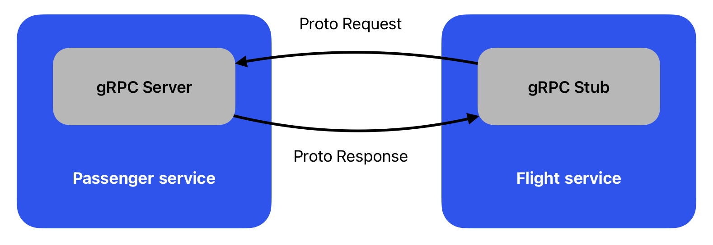
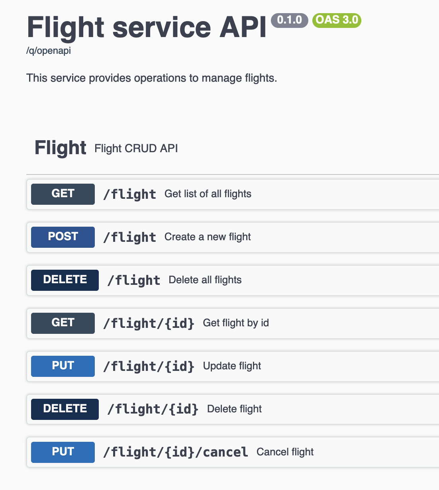
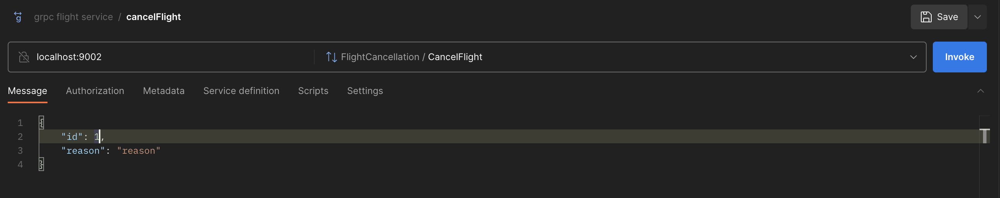

# 03 - OpenAPI specification and gRPC

## What is the role of API?

The primary role of the Application programming interface (API) is to allow easy communication between different software components. It should describe the functionality of the component and the way it can be used. The API should be easy to use and understand.

### Contract first approach

API is a first-class citizen, meaning it should be designed before implementation. This approach is called contract first. The contract is a document that describes the API. The most popular format for defining API documentation is OpenAPI.

It's a good approach to spend more time designing the API so other services (and teams) can rely on it when implementing their own services. It shouldn't be changed. If it's necessary to change the API, it should be done in a backward compatible way. Eg. versioning the api like `/api/v1/...` and `/api/v2/...`.

#### Benefits of contract first approach

- Teams can work in parallel on business logic since the API is already defined
- The API is designed with the client in mind
- No unused endpoints

#### Drawbacks of contract first approach

- Limited flexibility for changes in the API
- Upfront time and effort to design the API

### Code first approach

The code first approach is the opposite of the contract first approach. First, the code is written, and then the API is generated from the code.

#### Benefits of code first approach

- Easy to start
- Flexible with changing the API
- The API is always up to date

#### Drawbacks of code first approach

- The API is not designed with the client in mind
- May result in unused endpoints that are just "hanging around"

## OpenAPI specification

OpenAPI is a specification standard for describing REST APIs. It's a language-agnostic format that can be used to describe APIs for different programming languages.

It is an open standard for describing your APIs, allowing you to provide an API specification encoded in a JSON or YAML document embedding the fundamentals of HTTP and JSON.

### OpenAPI in Quarkus

Quarkus supports OpenAPI specification generation from the code via `quarkus-smallrye-openapi` extension that we installed in the first exercise.

#### Application annotation

We can extend OpenAPI specification with additional information using `@OpenAPIDefinition` annotation for the whole application.

```java

@OpenAPIDefinition(
        tags = {
                @Tag(name = "widget", description = "Widget operations."),
                @Tag(name = "gasket", description = "Operations related to gaskets")
        },
        info = @Info(
                title = "Example API",
                version = "1.0.1",
                contact = @Contact(
                        name = "Example API Support",
                        url = "http://exampleurl.com/contact",
                        email = "techsupport@example.com"),
                license = @License(
                        name = "Apache 2.0",
                        url = "https://www.apache.org/licenses/LICENSE-2.0.html"))
)
public class FlightServiceApplication extends Application {
    //...
}
```

Note that `FlightServiceApplication` extends `Application` class from `jakarta.ws.rs.core.Application`. It can define the components of an application and supplies additional meta-data. It's not necessary to extend this class, but it's required for the use of `@OpenAPIDefinition`.

It can also be done in `application.properties`:

```properties 
quarkus.smallrye-openapi.tags.widget.name=widget
quarkus.smallrye-openapi.tags.widget.description=Widget operations.
quarkus.smallrye-openapi.tags.gasket.name=gasket
quarkus.smallrye-openapi.tags.gasket.description=Operations related to gaskets
quarkus.smallrye-openapi.info.title=Example API
quarkus.smallrye-openapi.info.version=1.0.1
```

#### Resource annotation

We can also provide additional information for resources using `@Tag` annotation.

```java

@Tag(name = "Flight resource", description = "Provides Flight CRUD operations")
public class FlightResource {
    //...
}
```

#### Endpoint annotation

There are several annotations that can be used to provide additional information for endpoints.

- `@Operation` - provides information about the operation
- `@APIResponse` - provides information about the response
- `@Schema` - provides information about the schema

Best understood on an example from `passenger-service`:

```java
/**
 * Update passenger
 *
 * @param id        id of passenger
 * @param passenger passenger to update
 */
@PUT
@Path("/{id}")
@Produces(MediaType.APPLICATION_JSON)
@Consumes(MediaType.APPLICATION_JSON)
@Operation(summary = "Update passenger")
@APIResponse(
        responseCode = "200",
        description = "Updated passenger",
        content = @Content(
                mediaType = APPLICATION_JSON,
                schema = @Schema(implementation = Passenger.class, required = true),
                examples = @ExampleObject(name = "flight", value = Examples.VALID_PASSENGER)
        )
)
@APIResponse(
        responseCode = "404",
        description = "Passenger with given id does not exist"
)
public RestResponse<Passenger> update(@Parameter(name = "id", required = true, description = "Passenger id") @PathParam("id") int id,
                                      @Schema(implementation = Passenger.class, required = true)
                                      Passenger passenger) {
    if (passenger.id != id) {
        return RestResponse.status(Response.Status.BAD_REQUEST);
    }
    try {
        var updatedPassenger = passengerService.updatePassenger(passenger);
        return RestResponse.status(Response.Status.OK, updatedPassenger);
    } catch (IllegalArgumentException e) {
        return RestResponse.status(Response.Status.NOT_FOUND);
    }
}
```

When you run `quarkus dev` in `passenger-service`, you can see the OpenAPI specification in the browser at http://localhost:8078/q/openapi.

## What is gRPC?

gRPC is a high performance, open-source universal Remote Procedure Call (RPC) framework. It's based on HTTP/2 and Protocol Buffers. You can imagine it as a middleware between your service and the outside world. Simply put, client service with Stub is calling gRPC service as an async method call.



### Main features:

- HTTP/2 based - low latency, multiplexing, header compression, stream prioritization
- High performance - binary protocol, efficient serialization, asynchronous by default
- Bidirectional streaming - client and server can send messages at the same time

### Differences between REST and gRPC

| x             | REST                                   | gRPC                                                        |
|---------------|----------------------------------------|-------------------------------------------------------------|
| Data          | Text based                             | Binary                                                      |
| Data formats  | Loose, often using JSON or XML schemas | Strict, uses Protocol Buffers for schema definition         |
| Communication | One-directional                        | Supports bidirectional streaming                            |
| Methods       | HTTP verbs (POST, GET,...)             | RPC methods                                                 |

### Protocol Buffers

Protocol Buffers are Interface Definition Language (IDL) used to describe both the service interface and the structure of the payload messages. It's a binary format that is smaller and faster than JSON. It's defined in `.proto` files.

Sample `src/main/proto/helloworld.proto` file:

```proto
syntax = "proto3";

option java_multiple_files = true;
option java_package = "io.quarkus.example";
option java_outer_classname = "HelloWorldProto";

package helloworld;

// The greeting service definition.
service Greeter {
    // Sends a greeting
    rpc SayHello (HelloRequest) returns (HelloReply) {}
}

// The request message containing the user's name.
message HelloRequest {
    string name = 1;
    string surname = 2;
}

// The response message containing the greetings
message HelloReply {
    string message = 1;
}
```

From this file, Quarkus can generate Java classes that can be used in your application. To generate the classes, use `mvn compile`.

## State of the project

Since the last exercise, the project now includes 2 modules - `flight-service` and `passenger-service`.

- `flight-service` is a REST service that provides CRUD operations for flights. You already know this service from the previous exercises. Runs on port `8079`.
- `passenger-service` is a REST service that provides CRUD operations for passengers and gets new notifications. Also, it provides a gRPC interface to notify passengers about flight cancellations. It runs on port `8078`.

## Tasks

### 1. Add OpenAPI specification to `flight-service`

#### 1.1 Create information about the application

Create `FlightServiceApplication` class in `cz.muni.fi` that extends `Application` class from `jakarta.ws.rs.core.Application`. Add `@OpenAPIDefinition` annotation with `info` field. Add title, version, and description as shown in the screenshot below.


#### 1.2 Create information about the resource

Add `@Tag` annotation for `FlightResource` class. Provide name and description as shown in the screenshot below.

#### 1.3 Create information about the endpoints

Add `@Operation`, `@APIResponse`, `@Schema`, and `@Parameter` annotations for each method and parameter in `FlightResource` class similar to `PassengerResource` in `passenger-service`. You will find response examples in `Examples` class that you can use.

- `@Operation` - provide summary and description
- `@APIResponse` - provide response code, description, content, and schema
- `@Schema` - provide implementation and required
- `@Parameter` - provide name, required, and description



### 2. Generate Grpc classes

#### 2.1. Modify `flightcancellation.proto` file in `flight-service` and `passenger-service` module

Because we want our services to act independently, we have to define the same contract for both services.

In `flightcancellation.proto` file add under the configuration `FlightCancellation` service with `CancelFlight` rpc that will take `CancelFlightRequest` with `id` (int) and `reason` (string) fields. It will return `CancelFlightResponse` with `status` (`FlightCancellationResponseStatus` enum) field.

#### 2.2. Generate classes

Run `mvn compile` in services to generate classes from `.proto` file.

When you run this command, you should be able to generate classes in `flight-service/target/generated-sources/grpc/cz/muni/fi/proto` and `passenger-service/target/generated-sources/grpc/cz/muni/fi/proto` directories. Check if they are there. These files will be used in `passenger-service` to implement the gRPC service and in `flight-service` to implement the gRPC stub.

### 3. Implement `FlightCancellationService`

Now we will implement `FlightCancellationService` in `passenger-service` that will implement `FlightCancellation` rpc.

#### 3.1. Implement `cancelFlight` method

Implement `cancelFlight` method in `FlightCancellationService` class. There is a JavaDoc that describes what the method should do.

#### 3.2. Test it with DevUI or Postman

**Dev UI**

You can go to http://localhost:8078/q/dev-ui/io.quarkus.quarkus-grpc/services where you can test the gRPC service. You need to provide the id of the flight and the reason for the cancellation. The request shouldn't fail.

**Postman**

When you are done, run the passenger service in dev mode and try to call the gRPC service from Postman. You need to create a new gRPC collection in Postman with url `localhost:9000` and choose CancelFlight. The request shouldn't fail.



### 4. Use stub in `flight-service`

Because both `flight-service` and `passenger-service` have proto contracts, we can use stubs in `flight-service` to call `cancelFlight` method.

#### 4.1. Use Grpc Client to use Stub `FlightCancellationService` in `FlightService`

Now, similar to injecting `FlightService` into `FlightResource` with `@Inject`, we can inject `FlightCancellationService` into `FlightResource` with `@GrpcClient`. In `@GrpcClient`, we need to provide the name of the service that we want to use. In our case, it's `passenger-service`.

The class of stub that we are injecting is `MutinyFlightCancellationGrpc.MutinyFlightCancellationStub`. Methods in this class are asynchronous and return a `Uni` object. We can use `await().indefinitely()` to wait for the result.

#### 4.2. Implement `cancelFlight` method in `FlightService`

Implement `cancelFlight` method in `FlightService` that will call `cancelFlight` method on stub. You can use `await().indefinitely()` to wait for the result.

#### 4.3. Test it

Now, everything should be set up. You can run both services in dev mode to see if they are communicating correctly.

Scenario:
1. Create a new flight using `POST localhost:8079/flight`
2. Create new passenger using `POST localhost:8078/passenger` with flightId = id of flight from step 1
3. Cancel flight using `PUT localhost:8079/flight/{id}`
4. Check if there is a list of notifications in `GET localhost:8078/notification` that contains notifications about flight cancellation for passenger from step 2

### 5. Submit the solution

1. Finish the tasks
2. Push the changes to the main branch
3. GitHub Classroom automatically prepared a feedback pull request for you
4. Go to the repository on GitHub and find the feedback pull request
5. Set label to "Submitted"
6. GitHub Actions will run basic checks for your submission
7. Teacher will evaluate the submission as well and give you feedback

## Hints

- The type of id should be `int32` in the `.proto` file.
- For example, OpenAPI specification see `passenger-service` service.
- `@GrpcClient("passenger-service")`

## Troubleshooting

- If you are using IntelliJ, you can run `mvn compile` from the IDE Maven plugin under lifecycle. Idea has a problem of recognizing generated classes. Or reload all maven projects.
- There is also an option to right-click the generated sources directory and mark it as sources.

## Further reading

- https://quarkus.io
- https://www.openapis.org/
- https://swagger.io/resources/articles/adopting-an-api-first-approach/
- https://www.visual-paradigm.com/guide/development/code-first-vs-design-first/
- https://grpc.io/docs/what-is-grpc/introduction/
- https://quarkus.io/guides/grpc-getting-started